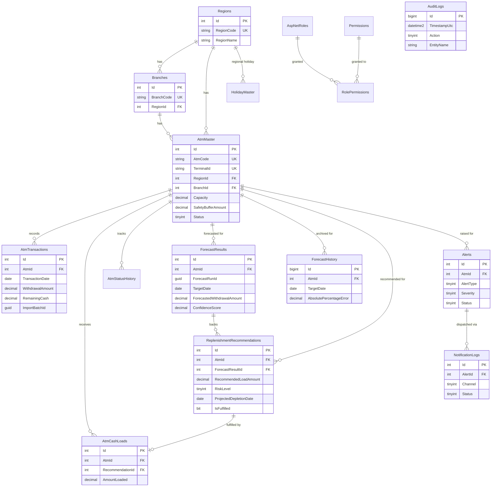

# Database Entity-Relationship Model

Full DDL: [`database/01_Schema.sql`](../database/01_Schema.sql). Identity tables
(`AspNetUsers`, `AspNetRoles`, `AspNetUserRoles`, ...) are generated by EF Core migrations, not
hand-scripted, to stay in lockstep with the installed `Microsoft.AspNetCore.Identity` version.

## Notable constraints

- `AtmTransactions` has a unique constraint on `(AtmId, TransactionDate)` — one aggregated row
  per ATM per day; see [ARCHITECTURE.md](ARCHITECTURE.md) for why.
- All foreign keys use `ON DELETE NO ACTION` (`Restrict` in EF Core) except
  `NotificationLogs → Alerts`, which cascades — deleting an alert's notification trail with it
  is safe; deleting master/transactional data by cascade is not (financial data integrity).
- `AuditLogs` has no soft-delete column and the application never issues `UPDATE`/`DELETE`
  against it — see `usp_ArchiveOldAuditLogs` for the retention-reporting (not deleting) pattern.
